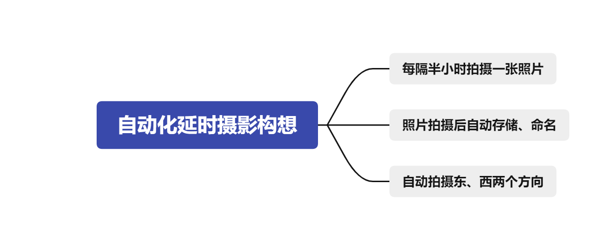
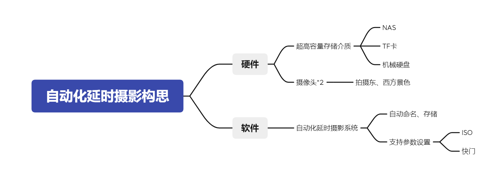

# Time-lapse-photography-system
## 自动化延时摄影系统  
>这是为了个人建立永久定点拍摄延时摄影而建立的仓库，可解决拍摄一个月以上延时摄影的痛点  
> 总之是个比较有意思的小项目，方案不算复杂，设计也存在一些值得改进的地方，当前正在招募编码人员。
> 
**自动化延时摄影构想**
  

**自动化延时摄影构思**

**当前进度**：
- [ ] 人员招募
- [ ] 方案设计
- [ ] 编码
- [ ] Debug测试
- [ ] 完成！